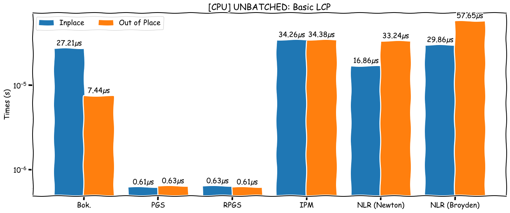
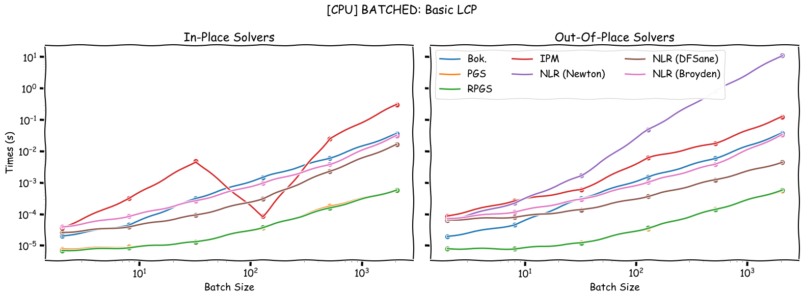

# Benchmarking Available LCP Solvers


## Useful Functions

```julia
using Statistics

function timer(f, args...; numtimes=5)
    f(args...) # compile
    times = zeros(numtimes)
    for i in 1:numtimes
        times[i] = @elapsed f(args...)
    end
    return median(times)
end
```

```
timer (generic function with 1 method)
```


## Load Dependencies

```julia
using BenchmarkTools, ComplementaritySolve, DataFrames, NonlinearSolve, PyPlot, StableRNGs
```


## Basic LCP

```julia
A₁ = [2.0 1; 1 2.0]
q₁ = [-5.0, 6.0]
```

```
2-element Vector{Float64}:
 -5.0
  6.0
```


### Unbatched Version

```julia
SOLVERS = [BokhovenIterativeAlgorithm(),
    PGS(),
    RPGS(),
    InteriorPointMethod(),
    NonlinearReformulation(),
    NonlinearReformulation(:smooth, Broyden(; batched=true)),
]
times = zeros(length(SOLVERS), 2)
solvers = ["Bok.", "PGS", "RPGS", "IPM", "NLR (Newton)", "NLR (Broyden)"]

for (i, solver) in enumerate(SOLVERS)
    @info "UNBATCHED: Benchmarking $(solvers[i])"
    prob_iip = LCP{true}(A₁, q₁, rand(StableRNG(0), 2))
    prob_oop = LCP{false}(A₁, q₁, rand(StableRNG(0), 2))
    times[i, 1] = timer(solve, prob_iip, solver)
    times[i, 2] = timer(solve, prob_oop, solver)
end
```





### Batched Version

Here we are batching the Problem with `N` starting values (typically batching LCPs involves
batching multiple `M` and `q`)


```julia
SOLVERS = [BokhovenIterativeAlgorithm(),
    PGS(),
    RPGS(),
    InteriorPointMethod(),
    NonlinearReformulation(:smooth, SimpleNewtonRaphson(; batched=true)),
    NonlinearReformulation(:smooth, SimpleDFSane(; batched=true)),
    NonlinearReformulation(:smooth, Broyden(; batched=true)),
]
BATCH_SIZES = 2 .^ (1:2:11)
times = zeros(length(SOLVERS), length(BATCH_SIZES), 2)
solvers = ["Bok.", "PGS", "RPGS", "IPM", "NLR (Newton)", "NLR (DFSane)", "NLR (Broyden)"]

for (i, solver) in enumerate(SOLVERS)
    @info "BATCHED: Benchmarking $(solvers[i])"
    for (j, N) in enumerate(BATCH_SIZES)
        prob_iip = LCP{true}(A₁, q₁, rand(StableRNG(0), 2, N))
        prob_oop = LCP{false}(A₁, q₁, rand(StableRNG(0), 2, N))
        times[i, j, 2] = timer(solve, prob_oop, solver)
        if i == 5
            times[i, j, 1] = -1 # SimpleNewtonRaphson is not implemented for inplace
            continue
        end
        times[i, j, 1] = timer(solve, prob_iip, solver)
    end
end
```





## Appendix

These benchmarks are a part of the SciMLBenchmarks.jl repository, found at: [https://github.com/SciML/SciMLBenchmarks.jl](https://github.com/SciML/SciMLBenchmarks.jl). For more information on high-performance scientific machine learning, check out the SciML Open Source Software Organization [https://sciml.ai](https://sciml.ai).

To locally run this benchmark, do the following commands:

```
using SciMLBenchmarks
SciMLBenchmarks.weave_file("/mnt/research/ComplementaritySolve.jl/benchmark/lcp","solvers.jmd")
```

Computer Information:

```
Julia Version 1.10.0-beta1
Commit 6616549950e (2023-07-25 17:43 UTC)
Platform Info:
  OS: Linux (x86_64-linux-gnu)
  CPU: 12 × AMD Ryzen 5 4600H with Radeon Graphics
  WORD_SIZE: 64
  LIBM: libopenlibm
  LLVM: libLLVM-15.0.7 (ORCJIT, znver2)
  Threads: 11 on 12 virtual cores
Environment:
  JULIA_PKG_USE_CLI_GIT = true
  JULIA_DEPOT_PATH = /mnt/julia:

```

Package Information:

```
Status `/mnt/research/ComplementaritySolve.jl/benchmark/Project.toml`
  [6e4b80f9] BenchmarkTools v1.3.2
  [b40a91a3] ComplementaritySolve v0.1.0 `..`
  [a93c6f00] DataFrames v1.6.1
  [8913a72c] NonlinearSolve v1.8.0
  [91a5bcdd] Plots v1.38.17
  [d330b81b] PyPlot v2.11.1
  [31c91b34] SciMLBenchmarks v0.1.3
  [860ef19b] StableRNGs v1.0.0
  [f3b207a7] StatsPlots v0.15.6
  [44d3d7a6] Weave v0.10.12
  [44cfe95a] Pkg v1.10.0
```

And the full manifest:

```
Status `/mnt/research/ComplementaritySolve.jl/benchmark/Manifest.toml`
  [47edcb42] ADTypes v0.1.6
  [621f4979] AbstractFFTs v1.4.0
  [79e6a3ab] Adapt v3.6.2
  [ec485272] ArnoldiMethod v0.2.0
  [7d9fca2a] Arpack v0.5.4
  [4fba245c] ArrayInterface v7.4.11
  [30b0a656] ArrayInterfaceCore v0.1.29
  [a9b6321e] Atomix v0.1.0
  [13072b0f] AxisAlgorithms v1.0.1
  [6e4b80f9] BenchmarkTools v1.3.2
  [d1d4a3ce] BitFlags v0.1.7
  [62783981] BitTwiddlingConvenienceFunctions v0.1.5
  [fa961155] CEnum v0.4.2
  [2a0fbf3d] CPUSummary v0.2.3
  [49dc2e85] Calculus v0.5.1
  [082447d4] ChainRules v1.53.0
  [d360d2e6] ChainRulesCore v1.16.0
  [fb6a15b2] CloseOpenIntervals v0.1.12
  [aaaa29a8] Clustering v0.15.4
  [523fee87] CodecBzip2 v0.7.2
  [944b1d66] CodecZlib v0.7.2
  [35d6a980] ColorSchemes v3.22.0
  [3da002f7] ColorTypes v0.11.4
  [c3611d14] ColorVectorSpace v0.10.0
  [5ae59095] Colors v0.12.10
  [38540f10] CommonSolve v0.2.4
  [bbf7d656] CommonSubexpressions v0.3.0
  [34da2185] Compat v4.8.0
  [b40a91a3] ComplementaritySolve v0.1.0 `..`
  [2569d6c7] ConcreteStructs v0.2.3
  [f0e56b4a] ConcurrentUtilities v2.2.1
  [8f4d0f93] Conda v1.9.1
  [187b0558] ConstructionBase v1.5.3
  [d38c429a] Contour v0.6.2
  [adafc99b] CpuId v0.3.1
  [a8cc5b0e] Crayons v4.1.1
  [9a962f9c] DataAPI v1.15.0
  [124859b0] DataDeps v0.7.11
  [a93c6f00] DataFrames v1.6.1
  [864edb3b] DataStructures v0.18.14
  [e2d170a0] DataValueInterfaces v1.0.0
  [8bb1440f] DelimitedFiles v1.9.1
  [2b5f629d] DiffEqBase v6.127.0
  [163ba53b] DiffResults v1.1.0
  [b552c78f] DiffRules v1.15.1
  [b4f34e82] Distances v0.10.9
  [31c24e10] Distributions v0.25.98
  [ffbed154] DocStringExtensions v0.9.3
  [fa6b7ba4] DualNumbers v0.6.8
  [4e289a0a] EnumX v1.0.4
  [460bff9d] ExceptionUnwrapping v0.1.9
  [e2ba6199] ExprTools v0.1.10
  [c87230d0] FFMPEG v0.4.1
  [7a1cc6ca] FFTW v1.7.1
  [7034ab61] FastBroadcast v0.2.6
  [29a986be] FastLapackInterface v2.0.0
  [1a297f60] FillArrays v1.5.0
  [6a86dc24] FiniteDiff v2.21.1
  [53c48c17] FixedPointNumbers v0.8.4
  [59287772] Formatting v0.4.2
  [f6369f11] ForwardDiff v0.10.35
  [069b7b12] FunctionWrappers v1.1.3
  [77dc65aa] FunctionWrappersWrappers v0.1.3
  [0c68f7d7] GPUArrays v8.8.1
  [46192b85] GPUArraysCore v0.1.5
  [28b8d3ca] GR v0.72.9
⌃ [d7ba0133] Git v1.2.1
  [86223c79] Graphs v1.8.0
  [42e2da0e] Grisu v1.0.2
  [cd3eb016] HTTP v1.9.14
  [eafb193a] Highlights v0.5.2
  [3e5b6fbb] HostCPUFeatures v0.1.15
  [34004b35] HypergeometricFunctions v0.3.23
  [7073ff75] IJulia v1.24.2
  [7869d1d1] IRTools v0.4.10
  [615f187c] IfElse v0.1.1
  [d25df0c9] Inflate v0.1.3
  [842dd82b] InlineStrings v1.4.0
  [a98d9a8b] Interpolations v0.14.7
  [41ab1584] InvertedIndices v1.3.0
  [92d709cd] IrrationalConstants v0.2.2
  [82899510] IteratorInterfaceExtensions v1.0.0
  [1019f520] JLFzf v0.1.5
  [692b3bcd] JLLWrappers v1.4.1
  [682c06a0] JSON v0.21.4
  [ef3ab10e] KLU v0.4.0
  [63c18a36] KernelAbstractions v0.9.8
  [5ab0869b] KernelDensity v0.6.7
  [ba0b0d4f] Krylov v0.9.2
  [929cbde3] LLVM v6.1.0
  [b964fa9f] LaTeXStrings v1.3.0
  [23fbe1c1] Latexify v0.16.1
  [10f19ff3] LayoutPointers v0.1.14
  [50d2b5c4] Lazy v0.15.1
  [7ed4a6bd] LinearSolve v2.4.1
  [2ab3a3ac] LogExpFunctions v0.3.24
  [e6f89c97] LoggingExtras v1.0.0
  [bdcacae8] LoopVectorization v0.12.165
  [1914dd2f] MacroTools v0.5.10
  [d125e4d3] ManualMemory v0.1.8
  [b8f27783] MathOptInterface v1.18.0
  [739be429] MbedTLS v1.1.7
  [442fdcdd] Measures v0.3.2
  [e1d29d7a] Missings v1.1.0
  [46d2c3a1] MuladdMacro v0.2.4
  [6f286f6a] MultivariateStats v0.10.2
  [ffc61752] Mustache v1.0.17
  [d8a4904e] MutableArithmetics v1.3.0
  [872c559c] NNlib v0.9.4
  [77ba4419] NaNMath v1.0.2
  [b8a86587] NearestNeighbors v0.4.13
  [8913a72c] NonlinearSolve v1.8.0
  [510215fc] Observables v0.5.4
  [6fe1bfb0] OffsetArrays v1.12.10
  [4d8831e6] OpenSSL v1.4.1
  [bac558e1] OrderedCollections v1.6.2
  [f5f7c340] PATHSolver v1.4.2
  [90014a1f] PDMats v0.11.17
  [65ce6f38] PackageExtensionCompat v1.0.0
  [d96e819e] Parameters v0.12.3
  [69de0a69] Parsers v2.7.2
  [b98c9c47] Pipe v1.3.0
  [ccf2f8ad] PlotThemes v3.1.0
  [995b91a9] PlotUtils v1.3.5
  [91a5bcdd] Plots v1.38.17
  [f517fe37] Polyester v0.7.5
  [1d0040c9] PolyesterWeave v0.2.1
  [2dfb63ee] PooledArrays v1.4.2
  [d236fae5] PreallocationTools v0.4.12
  [aea7be01] PrecompileTools v1.1.2
  [21216c6a] Preferences v1.4.0
  [08abe8d2] PrettyTables v2.2.7
  [438e738f] PyCall v1.96.1
  [d330b81b] PyPlot v2.11.1
  [1fd47b50] QuadGK v2.8.2
  [c84ed2f1] Ratios v0.4.5
  [c1ae055f] RealDot v0.1.0
  [3cdcf5f2] RecipesBase v1.3.4
  [01d81517] RecipesPipeline v0.6.12
  [731186ca] RecursiveArrayTools v2.38.7
  [f2c3362d] RecursiveFactorization v0.2.18
  [189a3867] Reexport v1.2.2
  [05181044] RelocatableFolders v1.0.0
  [ae029012] Requires v1.3.0
  [79098fc4] Rmath v0.7.1
  [7e49a35a] RuntimeGeneratedFunctions v0.5.11
  [94e857df] SIMDTypes v0.1.0
  [476501e8] SLEEFPirates v0.6.39
  [0bca4576] SciMLBase v1.94.0
  [31c91b34] SciMLBenchmarks v0.1.3
  [c0aeaf25] SciMLOperators v0.3.5
  [6c6a2e73] Scratch v1.2.0
  [91c51154] SentinelArrays v1.4.0
  [efcf1570] Setfield v1.1.1
  [992d4aef] Showoff v1.0.3
  [777ac1f9] SimpleBufferStream v1.1.0
  [727e6d20] SimpleNonlinearSolve v0.1.18
  [699a6c99] SimpleTraits v0.9.4
  [66db9d55] SnoopPrecompile v1.0.3
  [b85f4697] SoftGlobalScope v1.1.0
  [a2af1166] SortingAlgorithms v1.1.1
  [47a9eef4] SparseDiffTools v2.4.1
  [e56a9233] Sparspak v0.3.9
  [276daf66] SpecialFunctions v2.3.0
  [860ef19b] StableRNGs v1.0.0
  [aedffcd0] Static v0.8.8
  [0d7ed370] StaticArrayInterface v1.4.0
  [90137ffa] StaticArrays v1.6.2
  [1e83bf80] StaticArraysCore v1.4.2
  [82ae8749] StatsAPI v1.6.0
  [2913bbd2] StatsBase v0.34.0
  [4c63d2b9] StatsFuns v1.3.0
  [f3b207a7] StatsPlots v0.15.6
  [7792a7ef] StrideArraysCore v0.4.17
  [69024149] StringEncodings v0.3.7
  [892a3eda] StringManipulation v0.3.0
  [09ab397b] StructArrays v0.6.15
  [2efcf032] SymbolicIndexingInterface v0.2.2
  [ab02a1b2] TableOperations v1.2.0
  [3783bdb8] TableTraits v1.0.1
  [bd369af6] Tables v1.10.1
  [62fd8b95] TensorCore v0.1.1
  [8290d209] ThreadingUtilities v0.5.2
  [3bb67fe8] TranscodingStreams v0.9.13
  [d5829a12] TriangularSolve v0.1.19
  [410a4b4d] Tricks v0.1.7
  [781d530d] TruncatedStacktraces v1.4.0
  [5c2747f8] URIs v1.4.2
  [3a884ed6] UnPack v1.0.2
  [1cfade01] UnicodeFun v0.4.1
  [1986cc42] Unitful v1.15.0
  [45397f5d] UnitfulLatexify v1.6.3
  [013be700] UnsafeAtomics v0.2.1
  [d80eeb9a] UnsafeAtomicsLLVM v0.1.3
  [41fe7b60] Unzip v0.2.0
  [3d5dd08c] VectorizationBase v0.21.64
  [81def892] VersionParsing v1.3.0
  [19fa3120] VertexSafeGraphs v0.2.0
  [44d3d7a6] Weave v0.10.12
  [cc8bc4a8] Widgets v0.6.6
  [efce3f68] WoodburyMatrices v0.5.5
  [ddb6d928] YAML v0.4.9
  [c2297ded] ZMQ v1.2.2
  [e88e6eb3] Zygote v0.6.62
  [700de1a5] ZygoteRules v0.2.3
⌅ [68821587] Arpack_jll v3.5.1+1
  [6e34b625] Bzip2_jll v1.0.8+0
  [83423d85] Cairo_jll v1.16.1+1
  [2e619515] Expat_jll v2.5.0+0
  [b22a6f82] FFMPEG_jll v4.4.2+2
  [f5851436] FFTW_jll v3.3.10+0
  [a3f928ae] Fontconfig_jll v2.13.93+0
  [d7e528f0] FreeType2_jll v2.13.1+0
  [559328eb] FriBidi_jll v1.0.10+0
  [0656b61e] GLFW_jll v3.3.8+0
  [d2c73de3] GR_jll v0.72.9+0
  [78b55507] Gettext_jll v0.21.0+0
⌅ [f8c6e375] Git_jll v2.34.1+0
  [7746bdde] Glib_jll v2.74.0+2
  [3b182d85] Graphite2_jll v1.3.14+0
  [2e76f6c2] HarfBuzz_jll v2.8.1+1
  [1d5cc7b8] IntelOpenMP_jll v2023.1.0+0
  [aacddb02] JpegTurbo_jll v2.1.91+0
  [c1c5ebd0] LAME_jll v3.100.1+0
  [88015f11] LERC_jll v3.0.0+1
  [dad2f222] LLVMExtra_jll v0.0.23+0
  [1d63c593] LLVMOpenMP_jll v15.0.4+0
  [dd4b983a] LZO_jll v2.10.1+0
⌅ [e9f186c6] Libffi_jll v3.2.2+1
  [d4300ac3] Libgcrypt_jll v1.8.7+0
  [7e76a0d4] Libglvnd_jll v1.6.0+0
  [7add5ba3] Libgpg_error_jll v1.42.0+0
  [94ce4f54] Libiconv_jll v1.16.1+2
  [4b2f31a3] Libmount_jll v2.35.0+0
  [89763e89] Libtiff_jll v4.5.1+1
  [38a345b3] Libuuid_jll v2.36.0+0
  [856f044c] MKL_jll v2023.1.0+0
  [e7412a2a] Ogg_jll v1.3.5+1
⌅ [458c3c95] OpenSSL_jll v1.1.21+0
  [efe28fd5] OpenSpecFun_jll v0.5.5+0
  [91d4177d] Opus_jll v1.3.2+0
  [30392449] Pixman_jll v0.42.2+0
  [c0090381] Qt6Base_jll v6.4.2+3
  [f50d1b31] Rmath_jll v0.4.0+0
  [a2964d1f] Wayland_jll v1.21.0+0
  [2381bf8a] Wayland_protocols_jll v1.25.0+0
  [02c8fc9c] XML2_jll v2.10.3+0
  [aed1982a] XSLT_jll v1.1.34+0
  [ffd25f8a] XZ_jll v5.4.3+1
  [4f6342f7] Xorg_libX11_jll v1.8.6+0
  [0c0b7dd1] Xorg_libXau_jll v1.0.11+0
  [935fb764] Xorg_libXcursor_jll v1.2.0+4
  [a3789734] Xorg_libXdmcp_jll v1.1.4+0
  [1082639a] Xorg_libXext_jll v1.3.4+4
  [d091e8ba] Xorg_libXfixes_jll v5.0.3+4
  [a51aa0fd] Xorg_libXi_jll v1.7.10+4
  [d1454406] Xorg_libXinerama_jll v1.1.4+4
  [ec84b674] Xorg_libXrandr_jll v1.5.2+4
  [ea2f1a96] Xorg_libXrender_jll v0.9.10+4
  [14d82f49] Xorg_libpthread_stubs_jll v0.1.1+0
  [c7cfdc94] Xorg_libxcb_jll v1.15.0+0
  [cc61e674] Xorg_libxkbfile_jll v1.1.2+0
  [12413925] Xorg_xcb_util_image_jll v0.4.0+1
  [2def613f] Xorg_xcb_util_jll v0.4.0+1
  [975044d2] Xorg_xcb_util_keysyms_jll v0.4.0+1
  [0d47668e] Xorg_xcb_util_renderutil_jll v0.3.9+1
  [c22f9ab0] Xorg_xcb_util_wm_jll v0.4.1+1
  [35661453] Xorg_xkbcomp_jll v1.4.6+0
  [33bec58e] Xorg_xkeyboard_config_jll v2.39.0+0
  [c5fb5394] Xorg_xtrans_jll v1.5.0+0
  [8f1865be] ZeroMQ_jll v4.3.4+0
  [3161d3a3] Zstd_jll v1.5.5+0
⌅ [214eeab7] fzf_jll v0.29.0+0
  [a4ae2306] libaom_jll v3.4.0+0
  [0ac62f75] libass_jll v0.15.1+0
  [f638f0a6] libfdk_aac_jll v2.0.2+0
  [b53b4c65] libpng_jll v1.6.38+0
  [a9144af2] libsodium_jll v1.0.20+0
  [f27f6e37] libvorbis_jll v1.3.7+1
  [1270edf5] x264_jll v2021.5.5+0
  [dfaa095f] x265_jll v3.5.0+0
  [d8fb68d0] xkbcommon_jll v1.4.1+0
  [0dad84c5] ArgTools v1.1.1
  [56f22d72] Artifacts
  [2a0f44e3] Base64
  [ade2ca70] Dates
  [8ba89e20] Distributed
  [f43a241f] Downloads v1.6.0
  [7b1f6079] FileWatching
  [9fa8497b] Future
  [b77e0a4c] InteractiveUtils
  [4af54fe1] LazyArtifacts
  [b27032c2] LibCURL v0.6.4
  [76f85450] LibGit2
  [8f399da3] Libdl
  [37e2e46d] LinearAlgebra
  [56ddb016] Logging
  [d6f4376e] Markdown
  [a63ad114] Mmap
  [ca575930] NetworkOptions v1.2.0
  [44cfe95a] Pkg v1.10.0
  [de0858da] Printf
  [9abbd945] Profile
  [3fa0cd96] REPL
  [9a3f8284] Random
  [ea8e919c] SHA v0.7.0
  [9e88b42a] Serialization
  [1a1011a3] SharedArrays
  [6462fe0b] Sockets
  [2f01184e] SparseArrays v1.10.0
  [10745b16] Statistics v1.9.0
  [4607b0f0] SuiteSparse
  [fa267f1f] TOML v1.0.3
  [a4e569a6] Tar v1.10.0
  [8dfed614] Test
  [cf7118a7] UUIDs
  [4ec0a83e] Unicode
  [e66e0078] CompilerSupportLibraries_jll v1.0.5+0
  [deac9b47] LibCURL_jll v8.0.1+0
  [29816b5a] LibSSH2_jll v1.10.2+0
  [c8ffd9c3] MbedTLS_jll v2.28.2+0
  [14a3606d] MozillaCACerts_jll v2023.1.10
  [4536629a] OpenBLAS_jll v0.3.23+0
  [05823500] OpenLibm_jll v0.8.1+0
  [efcefdf7] PCRE2_jll v10.42.0+0
  [bea87d4a] SuiteSparse_jll v7.2.0+0
  [83775a58] Zlib_jll v1.2.13+0
  [8e850b90] libblastrampoline_jll v5.8.0+0
  [8e850ede] nghttp2_jll v1.52.0+0
  [3f19e933] p7zip_jll v17.4.0+0
Info Packages marked with ⌃ and ⌅ have new versions available, but those with ⌅ are restricted by compatibility constraints from upgrading. To see why use `status --outdated -m`
```

